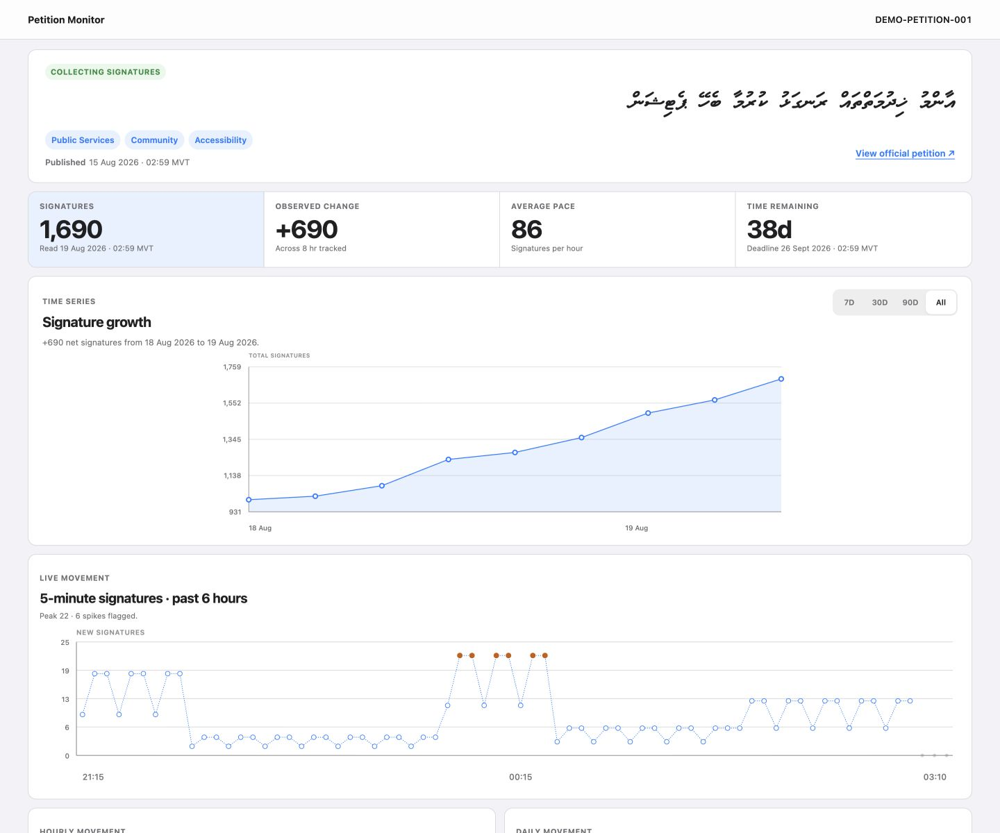

# Majlis Petition Monitor

An independent time-series monitor for public [People's Majlis e-petitions](https://epetition.majlis.gov.mv/petitions). It collects public petition metrics every 3 minutes, stores snapshots in Cloudflare D1, and serves the dashboard through the same Cloudflare Worker.

The project is designed for Cloudflare's free tier and uses Bun for local tooling.

## Preview



_Screenshot uses a generic petition identity and simulated signature history; it does not show a real petition record._

## Architecture

```text
Cron Trigger (every 3 minutes)
        │
        ▼
Cloudflare Worker ──────► Public Majlis petition pages
        │
        ├───────────────► D1: petitions, snapshots, status events
        │
        └───────────────► Worker Static Assets: HTML, CSS, JavaScript
```

There is no framework build, external chart service, paid queue, or always-on server. Static files are served from `public/`; requests under `/api/*` run through the Worker first.

## What is tracked

- Signature, withdrawn-signature, view, and share counts
- Public, internal, and lifecycle status
- Threshold levels and milestone dates
- Categories, reference number, publication date, and deadline
- A timestamped snapshot on every successful collection
- Five-minute movement over the latest 6 hours
- Hourly movement over the latest 24 hours
- Daily movement for up to 50 days
- Status changes and collection failures

The public source payload contains owner information that is unnecessary for this dashboard. The tracker deliberately does not store it.

## Requirements

- [Bun](https://bun.sh/) 1.3 or newer
- A Cloudflare account with Workers enabled
- A Cloudflare `workers.dev` subdomain, or an optional domain already managed by Cloudflare

## Local development

```sh
bun install
cp .dev.vars.example .dev.vars
bun run db:migrate:local
bun run dev
```

Wrangler normally starts at `http://localhost:8787`; use the URL printed in the terminal if that port is occupied.

In a second terminal, trigger the first local collection:

```sh
curl "http://localhost:8787/cdn-cgi/handler/scheduled?format=json"
```

Reload the page after the request completes. Local D1 state is stored under `.wrangler/`.

Run all checks with:

```sh
bun run check
```

## Configure petitions

`PETITION_URLS` accepts comma- or newline-separated public URLs in this exact form:

```text
https://epetition.majlis.gov.mv/petitions/<uuid>
```

Local example in `.dev.vars`:

```dotenv
PETITION_URLS="https://epetition.majlis.gov.mv/petitions/d996985f-8128-4957-82c1-8bf719001203,https://epetition.majlis.gov.mv/petitions/another-uuid"
```

Do not commit `.dev.vars`. It is already ignored by Git.

## Deploy to Cloudflare

These steps use the project-local Wrangler package through `bunx`.

### 1. Install and authenticate

```sh
bun install --frozen-lockfile
bunx wrangler login
bunx wrangler whoami
```

`wrangler login` opens Cloudflare's OAuth flow. `whoami` confirms which account Wrangler will use.

### 2. Create the D1 database

For a new deployment, create the remote database:

```sh
bun run db:create
```

Cloudflare returns a database UUID and a configuration snippet. Copy the UUID into `wrangler.jsonc`, replacing:

```jsonc
"database_id": "replace-with-your-d1-database-id"
```

Keep the existing binding and database name:

```jsonc
{
  "binding": "DB",
  "database_name": "majlis-petition-tracker",
  "database_id": "YOUR-D1-DATABASE-UUID",
  "migrations_dir": "migrations"
}
```

If you want to supply an Asia-Pacific primary-location hint when creating the database, use this command instead of `bun run db:create`:

```sh
bunx wrangler d1 create majlis-petition-tracker --location apac
```

### 3. Apply the production schema

```sh
bun run db:migrate:remote
```

This applies unapplied SQL files from `migrations/` to the remote D1 database. Confirm the operation when prompted.

You can inspect migration state with:

```sh
bunx wrangler d1 migrations list majlis-petition-tracker --remote
```

### 4. Create the Worker

Validate and deploy the Worker, static assets, D1 binding, and Cron Trigger:

```sh
bun run check
bun run deploy
```

Wrangler prints the deployed `workers.dev` URL. The first deployment also creates the Worker that production secrets will be attached to.

### 5. Add the petition URLs

Store the production URL list as a Worker secret:

```sh
bunx wrangler secret put PETITION_URLS
```

Paste one URL or a comma-separated list when prompted. Although petition URLs are public, keeping deployment-specific values outside the repository makes the same code reusable.

Current Wrangler behavior is important here: `wrangler secret put` creates and deploys a new Worker version immediately. You do not need to run another deployment after this command.

### 6. Verify collection

The Cron Trigger in `wrangler.jsonc` runs every 3 minutes:

```jsonc
"triggers": {
  "crons": ["*/3 * * * *"]
}
```

Cron schedules are evaluated in UTC. This particular expression is timezone-independent because it runs every third minute. New or changed triggers can take several minutes to propagate.

Open the URL printed by Wrangler, then check:

```sh
curl "https://YOUR-WORKER.YOUR-SUBDOMAIN.workers.dev/api/health"
curl "https://YOUR-WORKER.YOUR-SUBDOMAIN.workers.dev/api/petitions"
```

The first petition appears after the first successful scheduled collection, normally within a few minutes.

## Optional manual refresh endpoint

Set a long random token:

```sh
openssl rand -hex 32
bunx wrangler secret put REFRESH_TOKEN
```

Then request an immediate production collection:

```sh
curl -X POST \
  -H "Authorization: Bearer YOUR_REFRESH_TOKEN" \
  "https://YOUR-WORKER.YOUR-SUBDOMAIN.workers.dev/api/refresh"
```

If `REFRESH_TOKEN` is not configured, the endpoint returns `404`.

## Optional custom domain

The free `workers.dev` address is suitable for a personal or hobby deployment. To use a domain already active on Cloudflare, add a Custom Domain through **Workers & Pages → your Worker → Settings → Domains & Routes**, or add this to `wrangler.jsonc`:

```jsonc
"routes": [
  {
    "pattern": "petitions.example.com",
    "custom_domain": true
  }
]
```

Then run `bun run deploy`. Cloudflare creates the DNS record and manages the certificate. The hostname must not already have a conflicting CNAME record.

## Updating an existing deployment

```sh
bun install --frozen-lockfile
bun run check
bun run db:migrate:remote
bun run deploy
```

Apply migrations before deploying code that depends on them. Existing Worker secrets remain attached to the Worker; they do not belong in `wrangler.jsonc`.

## Monitoring and troubleshooting

- **No petitions appear:** run `/api/health`, confirm `PETITION_URLS` exists with `bunx wrangler secret list`, and inspect the Worker's Logs tab in Cloudflare.
- **`no such table` from D1:** run `bun run db:migrate:remote` and confirm the `database_id` points to the intended database.
- **Cron does not run immediately:** allow several minutes for trigger propagation. Manage Wrangler-deployed cron schedules in `wrangler.jsonc`, not separately in the dashboard.
- **Local `SQLITE_BUSY` during reload:** stop other Wrangler processes using this project and start `bun run dev` again. Do not delete `.wrangler/` unless you intentionally want to discard local history.
- **Inspect D1 usage:** open **Cloudflare Dashboard → D1 → majlis-petition-tracker → Metrics**.

Workers Logs are already enabled with 10% head sampling in `wrangler.jsonc`.

## Free-tier considerations

Cloudflare's current Workers Free plan includes 100,000 requests per day. D1 includes 5 million rows read per day, 100,000 rows written per day, and 5 GB of stored data. Static asset requests are free and unlimited under the documented Workers Static Assets pricing behavior.

One petition creates 480 scheduled snapshots per day at the default interval, plus updates to its current record and source health. This project is intended for a small number of petitions. Monitor D1 row usage as the list grows.

Workers Free permits 50 external subrequests per invocation. Each tracked petition requires a fetch from the Majlis portal, so keep the configured petition count comfortably below that limit.

## API

- `GET /api/petitions` — current summary for all tracked petitions
- `GET /api/petitions/:uuid?range=all` — petition data and snapshots; ranges are `7d`, `30d`, `90d`, or `all`
- `GET /api/health` — configured source count and last collection health
- `POST /api/refresh` — optional token-protected collection

## Source-site resilience

The Majlis portal is an Inertia application. The collector reads the public `data-page` payload embedded in petition HTML and does not require authentication or private APIs. If the portal changes its markup, collection failures are recorded in `tracked_sources` while previously collected history remains intact.

Use a considerate polling interval. The default 3-minute schedule should remain limited to petitions you actively track.

## Cloudflare documentation

Deployment instructions were checked against Cloudflare's official documentation on 19 August 2026:

- [Wrangler authentication and general commands](https://developers.cloudflare.com/workers/wrangler/commands/general/)
- [D1 Wrangler commands](https://developers.cloudflare.com/d1/wrangler-commands/)
- [D1 migrations](https://developers.cloudflare.com/d1/reference/migrations/)
- [Worker secrets](https://developers.cloudflare.com/workers/configuration/secrets/)
- [Cron Triggers](https://developers.cloudflare.com/workers/configuration/cron-triggers/)
- [Workers Static Assets bindings](https://developers.cloudflare.com/workers/static-assets/binding/)
- [`workers.dev` routing](https://developers.cloudflare.com/workers/configuration/routing/workers-dev/)
- [Custom Domains](https://developers.cloudflare.com/workers/configuration/routing/custom-domains/)
- [Workers pricing and D1 allowances](https://developers.cloudflare.com/workers/platform/pricing/)
- [Workers platform limits](https://developers.cloudflare.com/workers/platform/limits/)
